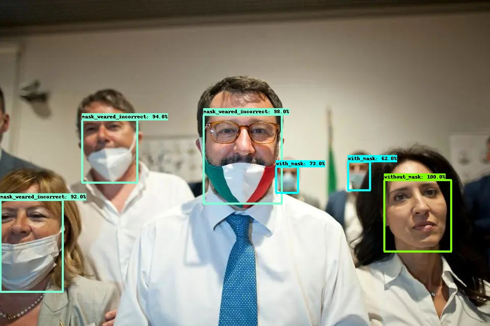
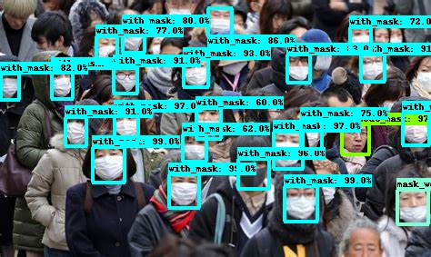

# mask-detection-based-on-tf2odapi

This repo created for mask detection based on TensorFlow 2 Object Detection API

 

 

 

 

 

### environment
  *   ubuntu 16.04.9 LTS
  *   python 3.6

### Requirements
  *   Cython==3.0a6
  *   tf_slim==1.1.0
  *   lvis==0.5.3
  *   gin_config==0.4.0
  *   tensorflow_addons==0.10.0
  *   tensorflow_gpu==2.3.1
  *   pycocotools==2.0.0
  *   pyyaml==5.4.1

conda install cudnn=7.6.4
