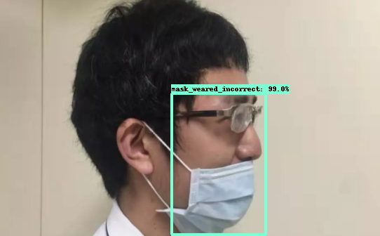
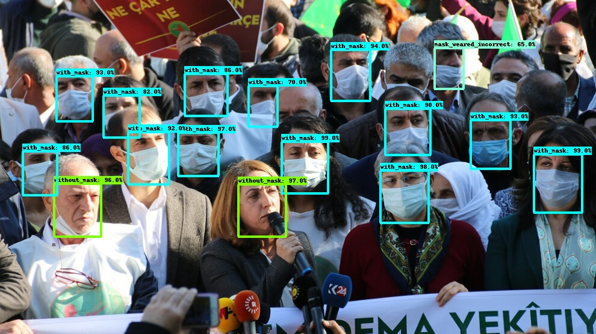

# mask-detection-based-on-tf2odapi
[](https://github.com/tensorflow/tensorflow/releases/tag/v2.3.1)
[](https://www.python.org/downloads/release/python-360/)


### Introduction 
This repository created for mask detection based on TensorFlow 2 Object Detection API. The pictures below are the results of [EfficientDet](https://arxiv.org/pdf/1911.09070v1.pdf) trained on [Kaggle face mask detection dataset](https://www.kaggle.com/andrewmvd/face-mask-detection), using pre-train model download from [here](http://download.tensorflow.org/models/object_detection/tf2/20200711/efficientdet_d0_coco17_tpu-32.tar.gz).<p align="center"> </p><p align="center"> </p><p align="center"> </p><p align="center"> </p>The latest [Object Detection API with TensorFlow 2](https://github.com/tensorflow/models/blob/master/research/object_detection/g3doc/tf2.md) installation will set [TensorFlow 2.5.0](https://github.com/tensorflow/tensorflow/releases/tag/v2.5.0) as default option, which means you have to upgrade your CUDA driver to 460 or higher, and CUDA version to 11.2. That would be time-consuming. So I split [object_detection](https://github.com/tensorflow/models/tree/master/research/object_detection) and [slim](https://github.com/tensorflow/models/tree/master/research/slim) which I will import in the following training, from [research](https://github.com/tensorflow/models/tree/master/research) in [models](https://github.com/tensorflow/models). Likewise [official](https://github.com/tensorflow/models/tree/master/official) API is also needed, and I put it in same directory with object_detection and slim in my repo. Now it can be trained under TensorFlow-gpu 2.3 without changing GPU environment, following the steps in Usage below.


### Environment
  *   ubuntu 16.04.9 LTS
  *   python 3.6
  *   CUDA 10.1
  *   Driver version 440


### Requirements
  *   Cython==3.0a6
  *   tf_slim==1.1.0
  *   lvis==0.5.3
  *   gin_config==0.4.0
  *   tensorflow_addons==0.10.0
  *   tensorflow_gpu==2.3.1
  *   pycocotools==2.0.0
  *   pyyaml==5.4.1


### Usage
```bash
# create conda virtual env
conda create --name py36_tf23 python=3.6

# activate py36_tf23 env
conda activate py36_tf23

# install requirements
bash install.sh

# install required cudnn. TensorFlow 2.1~2.3 require cudnn version 7.6
conda install cudnn=7.6.4

# set object_detection to the env path
export PYTHONPATH=$PYTHONPATH:"pwd":"pwd"/"slim"

# test install implement
python object_detection/builders/model_builder_tf2_test.py
```


```
"Speed/accuracy trade-offs for modern convolutional object detectors."
Huang J, Rathod V, Sun C, Zhu M, Korattikara A, Fathi A, Fischer I, Wojna Z,
Song Y, Guadarrama S, Murphy K, CVPR 2017
```
